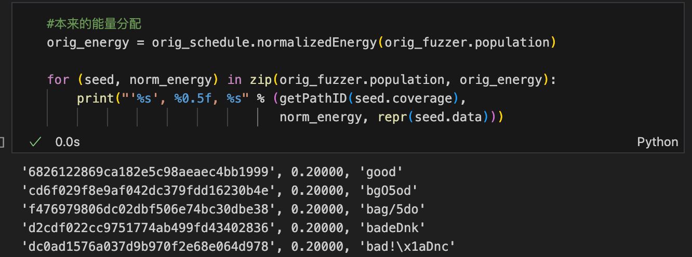
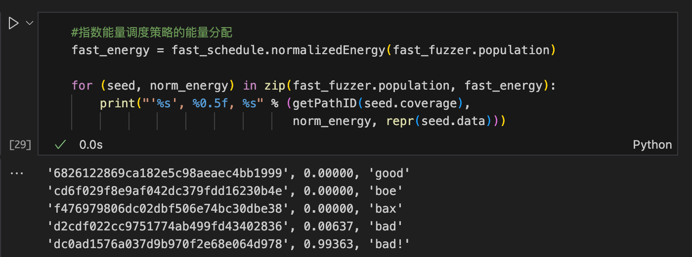

## 基于变异的模糊测试 - 黑盒和灰盒分析

介绍了一种基于突变的黑盒模糊测试器（AdvancedMutationFuzzer），它可以通过对初始种子进行变异生成新的输入。使用PowerSchedule来决定下一个种子（但默认的PowerSchedule中的每个种子的权重都是1，因此实际上就是随机选择）。 展示了如何使用这个模糊测试器生成输入，并测量其在执行30万个输入时的覆盖率。 使用population_coverage函数来测量模糊测试器生成的输入的覆盖率，并绘制覆盖率随时间的变化曲线。


#### 黑盒和灰盒的不同之处

区别：

选择种子：
黑盒中每个种子能量值=1，所以是均匀随机选择
灰盒根据各种策略（如覆盖率、基于频率、基于距离）的不同赋予不同能量值，指导选择

变异：

黑盒：不管输入的测试效果如何，继续随机变异
灰盒：记录并分析哪些输入触发了新路径，优先使用这些输入进行后续变异


## 基于变异的模糊测试 - 黑盒和灰盒分析

### 核心概念

#### 能量调度与变异的关系
- 能量调度决定选择哪个种子进行变异(分配测试时间)
- 变异器负责修改选中的种子以生成新测试用例
- 简而言之:能量调度选种子,变异器改种子

#### 黑盒vs灰盒测试的区别

#### 种子选择
- 黑盒:每个种子能量值相等(如=1),均匀随机选择
- 灰盒:基于覆盖率等策略赋予不同能量值,指导选择
如下面两个图


#### 变异方式  
- 黑盒:不考虑输入效果,继续随机变异
- 灰盒:记录分析哪些输入触发新路径,优先使用这些输入变异

### 改进的灰盒测试(Boosted Greybox Fuzzing)

#### 核心思想
- 为"不常见路径"的种子分配更多能量 
- 通过路径频率判断罕见程度
- 使用指数型能量调度分配能量

#### 关键实现
- Path ID:使用MD5哈希标识覆盖路径
- 能量计算公式: e(s) = 1/f(p(s))^a
  - f(p):路径执行频率
  - a:指数参数
  - s:种子输入


假设在执行了1000次测试后，我们得到以下路径执行频率：

路径1 (b***): 执行了500次

路径2 (ba**): 执行了300次

路径3 (bad*): 执行了150次

路径4 (bad!): 执行了50次

如果我们设定指数 a = 2，那么每个路径对应种子的能量计算为：

```
# 路径1的种子能量
e(s1) = 1 / (500^2) = 1/250000 = 0.000004

# 路径2的种子能量
e(s2) = 1 / (300^2) = 1/90000 ≈ 0.000011

# 路径3的种子能量
e(s3) = 1 / (150^2) = 1/22500 ≈ 0.000044

# 路径4的种子能量
e(s4) = 1 / (50^2) = 1/2500 = 0.0004
```
从计算结果可以看出：

- 执行频率越低的路径（如路径4 "bad!"），其对应种子获得的能量越高

- 路径4的种子能量是路径1的100倍，这意味着在后续测试中，它被选中的概率会大大增加

- 这种分配方式可以帮助模糊测试器更多地探索那些不常见的路径，提高测试的覆盖率

- 这就是为什么这种能量分配策略能够提高模糊测试的效率，因为它会优先测试那些较少被执行到的代码路径。

#### 优势
- 减少高频路径执行次数
- 增加低频路径执行机会 
- 能更快达到更高覆盖率

### 实践建议

- 可以尝试不同指数值调整能量分配策略
- 需注意过大指数可能导致浮点计算问题
- 目标是在覆盖率和执行效率间取得平衡